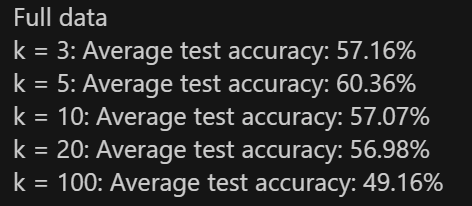

*Cross-validation:* while training and testing classification methods I will always be using 5-fold cross validation and presenting average results from these experiments, unless otherwise stated. Thus train to test dataset split is 80% to 20%.  

*Most used Python libraries:* sklearn, skimage, matplotlib, numpy, torch. 

# A public image dataset 

I am using a multi-class outdoor weather classification dataset [(Multi-Class Weather Classification from Still Image Using Said Ensemble Method | IEEE Conference Publication | IEEE Xplore).](https://ieeexplore.ieee.org/document/8704783) It contains 1125 images and 4 classes: 'cloudy', 'sunrise', 'rain' and 'shine'. With distribution of classes as such: {'cloudy': 300, 'shine': 253, 'sunrise': 357, 'rain': 215}. 

### Data preprocessing:  

Images were converted to greyscale and pixels were discretized to have 8-bit integer values. 

### Feature extraction: 

Looking at the sample images I thought that it might be a good idea to see if texture descriptors (e.g., Haralick features, LBP) can deal with this task. Therefore, I have picked local binary patterns (LBP) as my feature extraction mechanism. skimage python library defines 10 local binary patterns: 9 of them are called uniform and represent something like an edge, line, corner etc., whilst the last pattern is called non-uniform and does not represent anything. 

Let’s look at the mean class distribution of these patterns:

We can see that there are some differences present between the classes, it especially clear if we compare rain’s pattern distribution and cloudy’s pattern distribution. This will help the classifier to do its job. 

## Classifier #1, kNN: 

Experiments with this classifier will include picking different amount of neighbors (k = 3, 5, 10, 20, 100), fitting on a full dataset or an half of the dataset. Measurement metrics are test accuracy and confusion matrix. 

### Results: 

 

Row normalized confusion matrices: 

&emsp; &emsp; &emsp; k = 5, full data  &emsp;&emsp;&emsp;&emsp;&emsp;&emsp;&emsp; k = 100, full data 

 

## Classifier #2, MLP: 

I will be using a 3-layer MLP: input, hidden, output. Training will be done with the following parameters: cross entropy loss, learning rate = 0.03, optimizer – SGD with batch size of 16 datapoints. Experiments with this classifier will include using either 512 nodes or 10 nodes in the hidden layer, training on a full dataset or an half of the dataset. Measurement metrics are train loss, test and train accuracy and confusion matrix.  

### Results: 

Row normalized confusion matrices: 

&emsp;Full data, hidden layer nodes = 512 &emsp;&emsp;&emsp;  Full data, hidden layer nodes = 10 

   

## Summary: 

Regarding kNN: 1. It seems that it works the best when the amount of neighbors equals to 5. If we pick more than 20 neighbors then the performance will significantly degrade, which is as expected. 2. Decreasing the data by half seemed to have little impact on the accuracy of the algorithm.  

Regarding MLP: 1. As in the case with kNN decreasing the data in half seemed to have almost no impact on the model performance. 2. In my architecture of a 3-layer network, the hidden layer had 512 nodes or 10 nodes. Even though the complexity of the model was different, the testing accuracy produced was similar, so generalization capability was the same. However, the difference is seen in training accuracy, where the model with 512 nodes was a better fit for the data. 3. If there was more time, I would try out different learning rates, different network configurations and train for more epochs. 

In this experiment, kNN performed better than MLP. kNN approach was also faster, easier to implement and had less tunable parameters. On the other hand, MLP has a lot of tunable parameters, thus having a potential to outperform kNN, if enough time is allocated to explore the possibilities. In addition, local binary patterns are just one of many features I could have used in classifying this dataset. In the original paper, authors use ensemble of features and classifiers in order to achieve high classification accuracy. 

# A public text dataset

SMS Spam Collection v.1:[ \[PDF\] Contributions to the study of SMS spam filtering: new collection and results | Semantic Scholar.](https://www.semanticscholar.org/paper/Contributions-to-the-study-of-SMS-spam-filtering%3A-Almeida-Hidalgo/db6b56557d4b8c722e1fc504af4a361cfe1e22d8) This dataset consists of spam and non-spam SMS messages, labeled “spam” and “ham”. It contains 4,827 SMS legitimate messages (86.6%) and a total of 747 (13.4%) spam messages. 

### Data preprocessing:  

All messages are stripped of punctuations, stopwords (eg. “the”, “a”, “an”, “in”) and lowercased. 

### Feature extraction: 

Bag-of-words from sklearn library is used. Basically, features are word frequencies in spam and non-spam messages. 

## Classifier #1, Naïve Bayes: 

Experiments with this classifier will include picking different alphas (0.00001, 1.0, 10.0, 100.0). Measurement metrics are accuracy, precision, recall, f1-score and confusion matrix. 

### Results: 

   

Row normalized confusion matrices: 

&emsp;&emsp;&emsp; Alpha = 1.0 &emsp;&emsp;&emsp;&emsp;&emsp;&emsp;&emsp; &emsp; Alpha = 100.0 

 

## Classifier #2, SVM: 

Experiments with this classifier will include picking different kernels (polynomial or radial), using full data set or half of it. Measurement metrics are accuracy, precision, recall, f1-score and confusion matrix. 

### Results: 

 

Row normalized confusion matrices: 

&emsp;&emsp; Radial kernel, full data   &emsp;&emsp;&emsp;&emsp;    Radial kernel, half data  

   

&emsp; Polynomial kernel, full data    &emsp;&emsp;  Polynomial kernel, half data  

   

## Summary: 

Regarding Naïve Bayes, the default value of parameter in sklearn library alpha is 1.0. As seen in my experiments it proves to be the best choice for this case of SMS spam classification. 

Regarding SVM, we can see that use of radial kernel significantly beats the use of polynomial kernel. We can also see that halving the data used has no impact on the precision, but deals a significant blow to the recall score. 

In this experiment, both methods used, Naïve Bayes and SVM, performed on par. Furthermore, it seemed extremely easy for classifiers to correctly predict that non-spam were non-spam messages. On the other hand, it was a lot harder to say that spam is spam. Which I would say is not surprising, as humans commonly have similar performance in regards to telling if a message is spam or not. In addition,  

# A self-made image dataset 

This dataset is about classifying positions occurring during the physical exercise called “push- up”. It consists of two classes “up” and “down”, one is for images of when the body is positioned at an angle and not close to the floor, and the other one is for when the body is positioned horizontally and close to the floor. It consists of 32 images, 16 for each class. Some are taken in good brightness conditions (during the day) and some in a slightly worse (during the evening). 

&emsp;&emsp; Down position:                                   &emsp;&emsp;&emsp;            Up position: 

 

 

### Data preprocessing:  

Some of the images taken at night had to have a two-fold brightness increase for feature extraction to work. 

### Feature extraction: 

Google’s MediaPipe library for python was used to extract key body points from the images. Each image gives us 33 pairs of x and y coordinates of a human body parts’ relative position to each other. *Data augmentation* was also done by flipping the coordinates along the x axis. Thus making the dataset twice as big. 

 

## Classifier #1, kNN: 

Experiments with this classifier will include picking different amount of neighbors (k = 1, 3, 5, 10). Measurement metrics are accuracy, precision, recall, f1-score and confusion matrix. 

### Results: 

   

Row normalized confusion matrices: 

&emsp;&emsp;&emsp;&emsp;&emsp;&emsp; k = 1                     &emsp;&emsp;&emsp;&emsp;&emsp;&emsp;&emsp;&emsp;&emsp;&emsp;&emsp;&emsp;   k = 3 

   

&emsp;&emsp;&emsp;&emsp;&emsp;&emsp; k = 5                   &emsp;&emsp;&emsp;&emsp;&emsp;&emsp;&emsp;&emsp;&emsp;&emsp;&emsp;&emsp;      k = 10 

   

## Classifier #2, SVM: 

Experiments with this classifier will include picking different kernels (polynomial: degree = 1, 2,3, or radial). Measurement metrics are accuracy, precision, recall, f1-score and confusion matrix. 

### Results: 

 

 

&emsp;&emsp;&emsp;&emsp;&emsp; Radial kernel                  &emsp;&emsp;&emsp;&emsp;&emsp;&emsp;&emsp;&emsp;         Polynomial kernel, degree = 1 

   

&emsp;&emsp; Polynomial kernel, degree = 2     &emsp;&emsp;&emsp;        Polynomial kernel, degree = 3 

 

## Summary: 

Regarding kNN, having just one neighbor as a reference seemed to yield the best result for our model. 

Regarding SVM, amongst kernels used in the experiment polynomial with degree 2 seemed to perform the best. It is worth noting that the default degree in sklearn is 3, so the search for a better degree was worth it.  

In this experiment, I was pleasantly surprised how well kNN and SVM performed on such a small dataset (32 images). I think I would spend a lot more time trying to get MLP or any deep learning approach working as good as these models. Moreover, feature extractor provided by Google helped immensely. It allowed me to just deal with 33 integer coordinates instead of thousands of pixel values, making this classification task a lot simpler. 
